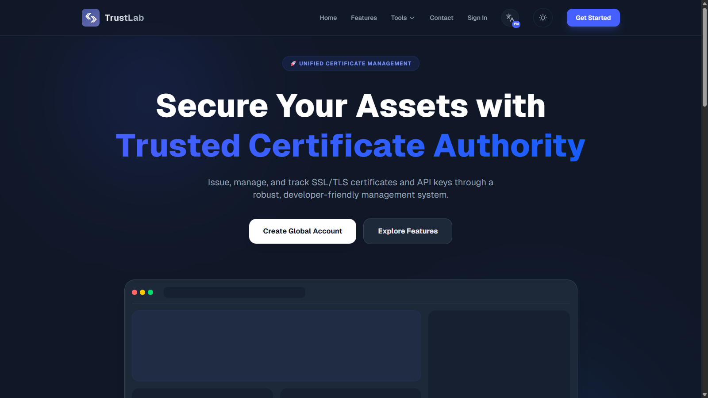

# TrustLab API

**TrustLab API** is the robust backend engine powering the TrustLab ecosystem. Built on Laravel 12, it provides secure authentication, comprehensive role-based access control, and specialized services for CA (Certificate Authority) management and user support.

## 🚀 Key Features

### 🔐 Advanced Authentication & Security
- **Multi-Guard Auth**: Powered by Laravel Sanctum for secure SPA (Single Page Application) authentication.
- **OAuth Integration**: "Mirror Callback" system handling Social Login (Google, GitHub) via Laravel Socialite.
- **Role Hierarchy**:
    - `Owner` (Supreme): Full control, manages Admins and Customers.
    - `Admin`: Manages `Customers` only. Cannot modify Owners.
    - `Customer`: Standard user access.
- **Email Verification**: Fully integrated verification flow with rigorous middleware protection (`verified`).
- **Turnstile Protected**: Endpoints designed to work with frontend-only Cloudflare Turnstile gatekeeping.

### 📜 Core Services
- **Certificate Management**: Logic for handling Certificate Authority operations (CSR, Keys, Signing).
- **Ticket System**: Complete support desk backend with attachment support and admin-user communication channels.
- **User Management**: Administrative endpoints for managing the user lifecycle (Ban, Promote, Verify).
- **Inquiry System**: Public contact form handling with database persistence and notification triggers.

## 🛠️ Technology Stack

- **Framework**: Laravel 12.x
- **Database**: MySQL / MariaDB
- **Authentication**: Laravel Sanctum
- **Permissions**: `spatie/laravel-permission`
- **Social Auth**: `laravel/socialite`
- **Testing**: PHPUnit

## 📂 Project Structure

- `app/Http/Controllers/Api`: Core API logic separated by domain (Admin, User, Public).
- `app/Models`: Eloquent models with strict typing and relationship definitions.
- `routes/api.php`: Centralized API route definitions grouped by middleware and version (`v1`).

---
&copy; 2024 TrustLab. All Internal Rights Reserved.
